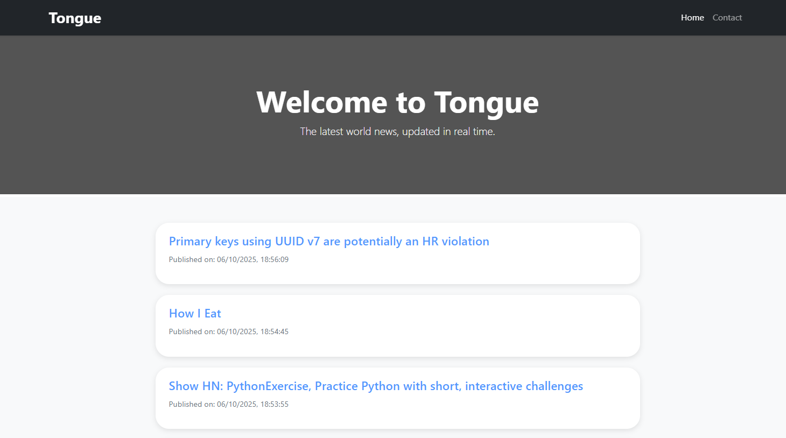

# Tongue

## English Version

### Description

**Tongue** is a real-time international news platform. The interface is modern, fast, and clean, designed to provide an immediate and pleasant reading experience.

### Features

* View the latest world news in real-time.
* "Load more news" button to fetch additional articles without reloading the page.
* Responsive design compatible with all devices.
* Navbar and footer with links to developer contacts and social profiles.

### Screenshot



### Go to the site  

[Click here: **Tongue**](tonguenews.netlify.app)

### Technologies Used

* HTML5
* CSS / SCSS
* JavaScript ES6+
* Bootstrap 5
* Webpack (for bundling and resource management)
* Hacker News API (for news data)

### Local Setup

1. Clone the repository:

   ```bash
   git clone https://github.com/your-username/tongue.git
   ```
2. Install dependencies:

   ```bash
   npm install
   ```
3. Start the development server with Webpack:

   ```bash
   npm run dev
   ```
4. Open `index.html` in the browser (usually at `http://localhost:8080`).

### Contacts

* GitHub: [P4wlee](https://github.com/p4wlee)
* LinkedIn: [Davide Paulicelli](https://www.linkedin.com/in/davide-paulicelli-00295222b/)

### License

This project is open source and available under the MIT License.

---

## Versione Italiana

### Descrizione

**Tongue** è una piattaforma di notizie internazionali aggiornata in tempo reale. L'interfaccia è moderna, veloce e pulita, pensata per offrire un'esperienza di lettura immediata e piacevole.

### Funzionalità

* Visualizzazione delle ultime notizie mondiali aggiornate in tempo reale.
* Pulsante "Load more news" per caricare ulteriori articoli senza ricaricare la pagina.
* Interfaccia responsive e compatibile con tutti i dispositivi.
* Navbar e footer con link ai contatti e ai profili social del developer.

### Screenshot


### Vai al sito 

[Clicca qui: **Tongue**](tonguenews.netlify.app)

### Tecnologie Utilizzate

* HTML5
* CSS / SCSS
* JavaScript ES6+
* Bootstrap 5
* Webpack (per bundling e gestione delle risorse)
* API di Hacker News (per le notizie)

### Setup Locale

1. Clonare il repository:

   ```bash
   git clone https://github.com/tuo-username/tongue.git
   ```
2. Installare le dipendenze:

   ```bash
   npm install
   ```
3. Avviare il server di sviluppo con Webpack:

   ```bash
   npm run dev
   ```
4. Aprire `index.html` nel browser (di solito `http://localhost:8080`).

### Contatti

* GitHub: [P4wlee](https://github.com/p4wlee)
* LinkedIn: [Davide Paulicelli](https://www.linkedin.com/in/davide-paulicelli-00295222b/)

### Licenza

Questo progetto è open source e disponibile sotto licenza MIT.
